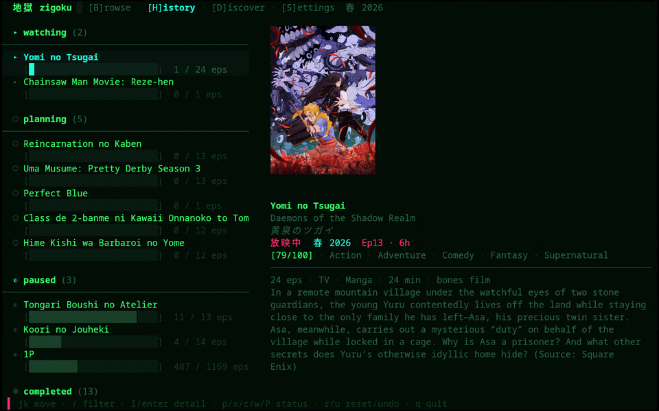
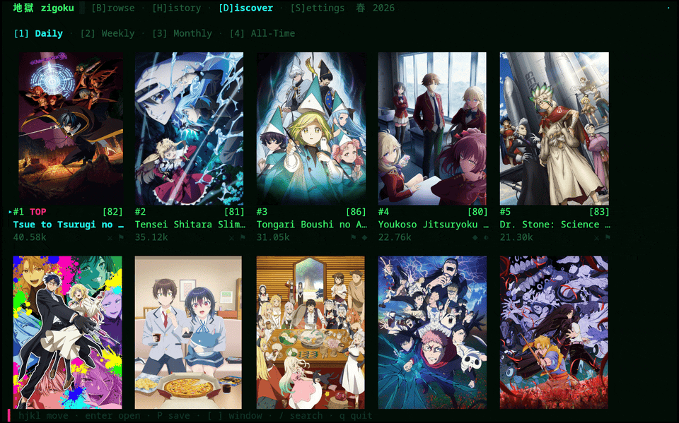
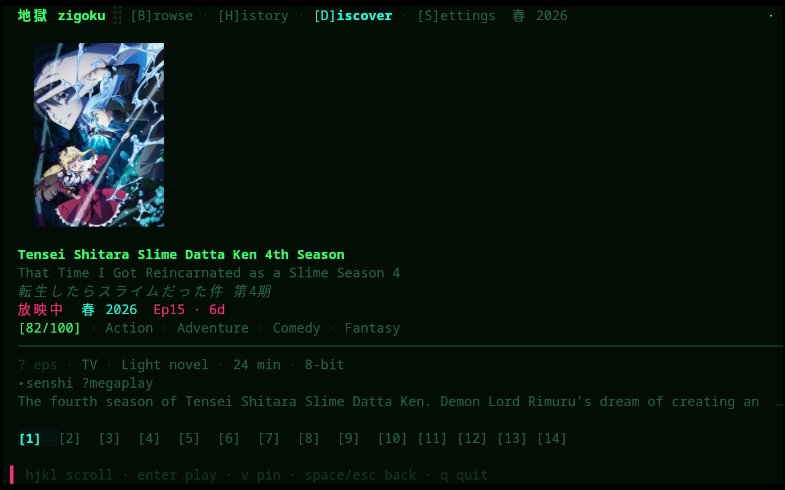
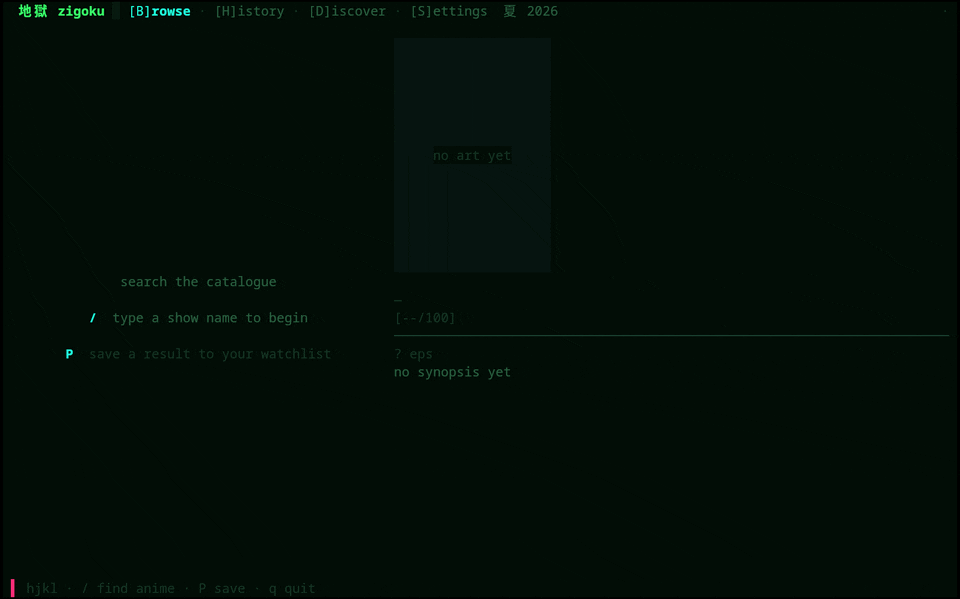
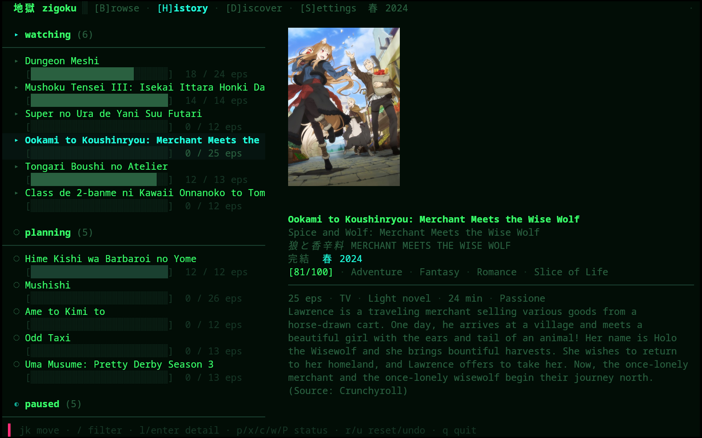
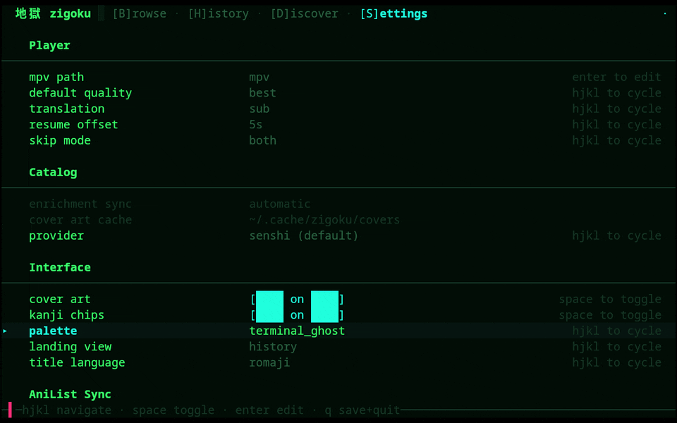

# zigoku · 地獄

[](https://github.com/vantroy/zigoku/actions/workflows/ci.yml)
[](https://github.com/vantroy/zigoku/releases/latest)
[](LICENSE)
[](https://ziglang.org/)
[](https://github.com/vantroy/zigoku/releases/latest)

A terminal anime browser & player, built from scratch in [Zig](https://ziglang.org/).

> *Zig + jigoku ("hell").* A ground-up reimagining of the abandoned `ani-nexus-tui`,
> and — above all — a vehicle for learning Zig. This is a personal learning
> project: expect sharp edges, opinionated choices, and commit messages that
> double as study notes — see [Why this exists](#why-this-exists) for the
> story and how it's built.

## Contents

- [Screenshots / Demo](#screenshots--demo)
- [What it does today](#what-it-does-today)
- [Install](#install)
- [Development](#development)
- [Stack](#stack)
- [Why this exists](#why-this-exists)
- [Acknowledgements](#acknowledgements)
- [Milestones](#milestones)

## Screenshots / Demo



*Hero: real cover art, painted straight to the framebuffer via the Kitty graphics
protocol — no halfblocks, no ASCII. The watchlist's cover repaints on every selection,
a filter narrows the list to one title, and its detail rests on cover, kanji chips, and
synopsis.*

---



*Discover: a ranked wall of real cover art — ten shows a screen, across `Daily` /
`Weekly` / `Monthly` / `All-Time`. Moving the selection sweeps cover to cover; switching
the ranking window reloads a fresh wall, live from AllAnime + AniList.*



*Discover detail: one result opened — real cover art, kanji metadata chips, AniList
score, reflowed synopsis, and the episode grid, in a single pane.*

---



*Browse: type a query and the catalogue search runs live — results and their cover art
stream into the two-pane view as AllAnime and AniList answer. Opening a result lands on
its detail.*



*Watchlist, scrolled into `planning`: grouped status headers, per-show progress bars,
and the real cover for whichever title is selected.*



*Themes tour: cycle the palette in Settings — `terminal_ghost` → `phosphor` → `nord` →
`tokyonight` — then jump back to a live detail to see the re-theme already applied
app-wide, not just the Settings tab.*

---

## What it does today

- **Full TUI** (libvaxis): two-pane shell — infinite-scroll search, detail pane
  (kanji metadata chips, reflowed synopsis, episode grid with resume `▸` / watched
  `●` markers), grouped watchlist, toasts, spinner, status bar.
- **Watchlist & watch-state**: planning / watching / paused / dropped / completed
  statuses, grouped headers, fuzzy filtering, one card per show no matter how many
  providers or languages it's tracked under (a sub and a dub entry collapse to a
  single card). Add from browse with `P`; move state with `p`/`x`/`c`/`w`/`P`;
  recompute progress with `r`; undo with `u`. Watchlist refreshes in-session after
  playback.
- **Discover**: an AniList-backed ranked feed — `Trending` / `Popular` / `Top Rated`
  / `This Season` windows of shows with real cover art, score badges, and genre
  glyphs; save a pick straight to the watchlist.
- **Cover art** via Kitty graphics where supported, halfblock cells elsewhere —
  fetched asynchronously, behind LRU caches.
- **Search → resolve → play**: catalog search and metadata come from AniList;
  picking a result resolves it to a streaming provider, lists episodes, and plays
  in `mpv`.
- **Multiple streaming providers, with automatic fallback**: senshi.live and
  megaplay both serve streams — if an episode fails to load on one, zigoku tries
  the next automatically. A provider-order preference in Settings controls which
  is tried first, a per-show pin locks a title to one provider, and `v` flips a
  show to another on demand. The detail view's provider row shows which source is
  serving the current show and which others have it. Soft-subtitle sidecars are
  passed to `mpv` as a proper subtitle track.
- **History & resume** (SQLite, raw C interop): watch history, exact resume
  positions via mpv's IPC socket (checkpointed during playback, persisted on quit),
  status-aware episode-list cache.
- **AniList enrichment**: richer metadata (season, genres, native title, format)
  and cover art from AniList — surfaced as kanji chips, persisted to the store.
- **AniList account sync**: connect from Settings or `zigoku login`, and your
  watchlist syncs both ways in the background — progress logged locally pushes up,
  changes made on AniList pull down, each with a small toast. A toggle in Settings
  turns it off if you'd rather keep your list local.
- **Config & settings**: live-editable settings tab (mpv path, quality, language,
  AniSkip mode, cover art, themes). Persisted to `~/.config/zigoku/config.zon`.
  Four palettes: `terminal_ghost` (default), `phosphor`, `nord`, `tokyonight`.
- **Scriptable CLI**: `zigoku <query>` runs the original search → pick → play flow,
  headless-friendly.

## Install

**One hard runtime dependency across all install methods: `mpv`.**
The binary shells out to whatever `mpv` is on your `PATH` to play video.
Without it, you get a browser. A very nice browser, but still.

### Quick install (Linux & macOS)

```sh
curl -fsS https://raw.githubusercontent.com/vantroy/zigoku/master/install.sh | sh
```

Detects your OS and architecture, downloads the matching release tarball,
verifies it against the published `sha256sums.txt`, and installs the `zigoku`
binary to `~/.local/bin`. Works on x86_64 and aarch64, Linux and macOS.

Knobs (all optional):

```sh
ZIGOKU_VERSION=0.3.1 ...   # pin a release instead of taking the latest
BINDIR=/usr/local/bin ...  # install somewhere else (PREFIX also honored)
```

Piping a script into a shell is trust-on-first-use, so if you'd rather read it
first, download and run it in two steps:

```sh
curl -fsSO https://raw.githubusercontent.com/vantroy/zigoku/master/install.sh
less install.sh && sh install.sh
```

The installer never installs an unverified download: a checksum mismatch aborts
before anything is unpacked.

### AUR (Arch Linux)

`paru -S zigoku` (or `yay`) is the goal, but AUR new-account registration has
been closed since mid-June 2026, so the package isn't on the registry yet. The
[`PKGBUILD`](packaging/aur/zigoku/PKGBUILD) is done and tested, though — build it
straight from the repo in the meantime:

```sh
git clone https://github.com/vantroy/zigoku.git
cd zigoku/packaging/aur/zigoku
makepkg -si          # compiles the release with your system Zig, then installs
```

It's a from-source package: it links your system `sqlite` and pulls `mpv` at
runtime. The moment registration reopens, this lands on the AUR and the one-liner
above becomes `paru -S zigoku`.

### macOS: Homebrew

```sh
brew install vantroy/zigoku/zigoku
```

The fully-qualified name taps [`vantroy/homebrew-zigoku`](https://github.com/vantroy/homebrew-zigoku)
implicitly — no separate `brew tap` needed. You get a prebuilt, SQLite-bundled
binary for your arch (Apple Silicon or Intel), and Homebrew pulls `mpv` as a
dependency. Upgrades ride `brew upgrade`.

### Prebuilt binary (Linux)

Fully static, no shared-lib deps — not even glibc. SQLite is compiled in.
Runs on any Linux of that architecture; no Zig toolchain required.

1. Download the tarball for your arch from the [latest release](https://github.com/vantroy/zigoku/releases/latest):

   | Architecture | File |
   |---|---|
   | x86_64 (most desktops/servers) | `zigoku-vX.Y.Z-x86_64-linux-musl.tar.gz` |
   | aarch64 (ARM64) | `zigoku-vX.Y.Z-aarch64-linux-musl.tar.gz` |

2. Verify it against `sha256sums.txt` from the same release page (encouraged):

   ```sh
   sha256sum -c --ignore-missing sha256sums.txt
   ```

3. Extract and put it on your `PATH`:

   ```sh
   tar -xzf zigoku-vX.Y.Z-<target>.tar.gz
   mv zigoku ~/.local/bin/          # or wherever your PATH points
   # no chmod needed — tar preserves the executable bit
   ```

4. Run it:

   ```sh
   zigoku
   ```

Cover art looks best in a terminal with the Kitty graphics protocol (kitty,
ghostty, WezTerm); everywhere else you get halfblock cells. Functional either way.

### From source

```sh
git clone https://github.com/vantroy/zigoku.git
cd zigoku
./scripts/install.sh            # builds ReleaseSafe → ~/.local/bin/zigoku
```

The installer builds in `ReleaseSafe` and drops the binary in your prefix's
`bin/`. Override the prefix with `--prefix DIR` (or `PREFIX=DIR`), and remove
the binary later with `./scripts/install.sh --uninstall`. If `~/.local/bin`
isn't on your `PATH`, the installer tells you how to add it.

**Requirements:** Zig **0.16.0+** and system `sqlite3` (with dev headers) to build.

---

Once installed:

```sh
zigoku                        # no args → the TUI
zigoku frieren                # CLI flow: search → pick → play
zigoku "cowboy bebop" --dub
zigoku <query> --debug        # diagnostics to stderr (CLI) or the log file (TUI)
```

## Development

To work on Zigoku without installing, drive it through `zig build`:

```sh
zig build run                 # no args → the TUI
zig build run -- frieren      # CLI flow: search → pick → play
zig build run -- "cowboy bebop" --dub
zig build test                # run the unit tests
./scripts/e2e.sh              # end-to-end harness (stubs mpv; offline-safe)
```

The spikes in [`src/spikes/`](src/spikes/) are self-contained throwaway programs that de-risked the hard unknowns before the real architecture existed — HTTP + JSON, SQLite via C interop, threads + a channel, the AllAnime stream resolver, mpv playback, and a TUI smoke test. Each has its own runnable build step:

```sh
zig build spike-http          # AniList HTTP search
zig build spike-sqlite        # SQLite C-interop
zig build spike-concurrency   # thread pool + channel
zig build spike-stream        # AllAnime stream resolver
zig build spike-mpv           # full pipeline → play in mpv
zig build spike-tui           # libvaxis boot smoke test
```

**[SPIKES.md](SPIKES.md)** is the annotated tour — useful if you want to understand the decisions before diving into the real modules.

## Stack

- **TUI:** libvaxis (Kitty graphics + halfblock fallback)
- **Storage:** SQLite via raw C interop
- **Concurrency:** thread pool + channels
- **Streaming:** senshi.live + megaplay, both behind the `SourceProvider`
  interface, with automatic fallback between them
- **Catalog:** AniList — backs search, Discover, metadata & cover art

## Why this exists

The original goal was to learn Zig, and reading the language reference only
gets you so far. A real project — with networking, C interop, threads, a TUI,
and a database — forces you through the parts a toy exercise never touches. An
anime terminal player happened to be the itch worth scratching (RIP
`ani-nexus-tui`), so it became the learning vehicle.

What the project actually turned into is worth stating plainly: most of the
code here is written by AI — a personal agent setup ([`pi-code`](https://pi.dev/)) driving an
ensemble of models, organized as a small crew for implementation, review, and
verification — while the human side of the project owns the architecture, the
milestone planning, the design decisions, and the review of everything that
lands. The pace of the commit history
reflects that division of labor; nobody learned Zig from scratch and shipped
five milestones in a weekend, and this README won't pretend otherwise. The
learning still happens — it just moved up a layer: studying the generated
code, questioning its choices, and understanding every line well enough to
direct the next one. The clearest artifact of that process is the **spikes**. Before any real
architecture existed, every risky unknown got its own throwaway program in
[`src/spikes/`](src/spikes/) — HTTP + JSON, SQLite via C interop, threads + a
channel, the AllAnime stream resolver, mpv playback, and a TUI smoke test. Each
is a self-contained `main` with its own `zig build spike-*` step, never imported
by the real app; the ideas got promoted into proper modules, but the spikes stay
behind as runnable reference. **[SPIKES.md](SPIKES.md)** is a guided, annotated
tour through them, written as the Zig 0.16 crash course I wish had existed —
including the "writergate" `Io` story that breaks most pre-0.16 tutorials you'll
find online.

## Acknowledgements

- **[anipy-cli](https://github.com/sdaqo/anipy-cli)** by [sdaqo](https://github.com/sdaqo) (GPL-3.0) — zigoku's original streaming source was AllAnime, and anipy-cli showed the way when every other source had gone dark. The working recipe (POST instead of GET, Apollo persisted-query hashes, and the AES-256-GCM `tobeparsed` scheme) was learned by studying its `allanime_provider.py`; zigoku reimplemented the wire protocol in Zig from observed behavior — no code is copied — but the trail was theirs. AllAnime has since been retired as the streaming source, but the credit — and the GPL lineage noted in [License](#license) — stands. Thank you. 🙏
- **[ani-nexus-tui](https://github.com/OsamuDazai666/ani-nexus-tui)** (CC BY-NC-SA 4.0) — studied for feature/UX inspiration.
- Catalog metadata & cover art from **[AniList](https://anilist.co/)**.

## Milestones

A record of the journey — `ROD-NN` issue IDs in commit messages map to each milestone below.

| Milestone | Scope | Status |
|-----------|-------|--------|
| **M0** | Foundation & spikes (HTTP, SQLite, concurrency, resolver, mpv) | ✅ done |
| **M1** | Vertical slice: CLI search → pick → play | ✅ done |
| **M2** | Persistence: SQLite history, resume, episode cache | ✅ done |
| **M3** | TUI shell: libvaxis, tabs, search/detail/history views | ✅ done |
| **M4** | Cover art: Kitty graphics, async pipeline, LRU caches, AniList bridge | ✅ done |
| **M5** | Playback polish: mpv IPC position ✅, checkpoints & exact resume ✅, AniSkip ✅, broader stream coverage ✅ | ✅ done |
| **M6** | Config & settings: config file ✅, settings tab ✅, themes ✅ | ✅ done |
| **M7** | Distribution & hardening: error/logging pass ✅, cross-platform paths ✅, installer & release build ✅ | ✅ done |
| **M8** | Nice-to-haves: quality selector ✅, wide-terminal history layout ✅, detail/episode caching ✅, post-playback state sync ✅ | ✅ done |
| **M9** | Polish — *the watchlist Odyssey*: watch-state machine + grouped history ✅, add-to-watchlist from browse ✅, progress recompute + single-level undo ✅, episode resume/watched chips ✅, richer detail metadata as kanji chips ✅, History↔Browse two-pane unification ✅, selection & active-pane focus hierarchy ✅, in-session refresh after playback ✅, four god-file carvings + tick/draw split ✅, DESIGN.md reconciliation ✅ | ✅ done |
| **M10** | Release: tag-driven builds + GitHub Releases ✅, Homebrew ✅, macOS CI ✅, README badges & media ✅ — AUR pending (see [Install](#install)) | ✅ mostly done |

## License

[GPL-3.0-or-later](LICENSE). Zigoku is free software: you can redistribute it
and/or modify it under the terms of the GNU General Public License as published
by the Free Software Foundation, either version 3 of the License, or (at your
option) any later version.

Our reference for the AllAnime protocol, anipy-cli, is GPL-3.0; even though
Zigoku reimplements the protocol rather than copying code, a GPL license keeps
the lineage unambiguous — and it's one we're happy to carry anyway.
